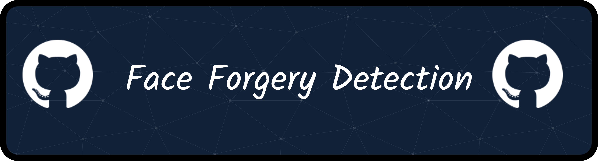

# Face & Audio Forgery Detection

<div align="center">
  
</div>


Image and audio forgery detection system based on natural trace extraction and filtering.

## HuggingFace Resources

- Image Model Weights: [OhMyYuwan/face-forgery-detection](https://huggingface.co/OhMyYuwan/face-forgery-detection)
- Audio Model Weights: [OhMyYuwan/audio-forgery-detection](https://huggingface.co/OhMyYuwan/audio-forgery-detection)
- Space Demo: [OhMyYuwan/face-forgery-detection](https://huggingface.co/spaces/OhMyYuwan/face-forgery-detection)

## Project Structure

```
face-forgery-detection/
├── datasets/
│   ├── image/                     # Image datasets
│   └── audio/                     # Audio datasets
│       └── asvspoof2019_la/
├── OhMyYuwan/
│   ├── face-forgery-detection/    # Image model registry and weights
│   └── audio-forgery-detection/   # Audio model registry and weights
├── scripts/
│   ├── image/                     # Image evaluation and training scripts
│   │   ├── evaluation/
│   │   └── train/
│   └── audio/                     # Audio evaluation and training scripts
│       ├── evaluation/
│       └── train/
├── Space/                         # Gradio demo application
├── results/
├── evaluate_parallel.sh
├── space_manager.sh
└── README.md
```

## Image Models

| Model | Backbone | Input Size |
|-------|----------|------------|
| convnext_base | ConvNeXt-Base | 224x224 |
| dinov2_base | DINOv2-Base | 224x224 |
| fastervit_2 | FasterViT-2 | 224x224 |
| inceptionnext_base | InceptionNeXt-Base | 224x224 |
| internvit_300m | InternViT-300M | 448x448 |
| mambavision_t | MambaVision-T | 224x224 |
| maxvit_base | MaxViT-Base | 224x224 |

## Audio Models

| Model | Backbone | EER |
|-------|----------|-----|
| wav2vec2_base | facebook/wav2vec2-base | 0.10% |

## Quick Start

### 1. Clone Repository

```bash
git clone https://github.com/OhMyYuwan/face-forgery-detection
cd face-forgery-detection
```

### 2. Install Dependencies

```bash
pip install -r requirements.txt
```

> **Note:** `mamba-ssm` requires CUDA and may need to be built from source on some systems:
> ```bash
> pip install mamba-ssm --no-build-isolation
> ```

### 3. Download Model Files

```bash
git lfs install
git clone https://huggingface.co/OhMyYuwan/face-forgery-detection OhMyYuwan/face-forgery-detection
```

Or skip large files initially and pull later:

```bash
GIT_LFS_SKIP_SMUDGE=1 git clone https://huggingface.co/OhMyYuwan/face-forgery-detection OhMyYuwan/face-forgery-detection
cd OhMyYuwan/face-forgery-detection && git lfs pull && cd ../..
```

### Launch Gradio Demo

```bash
./space_manager.sh start    # Start service in background
./space_manager.sh status   # Check service status
./space_manager.sh stop     # Stop service
```

### Model Inference

```python
import json
import importlib.util
from pathlib import Path
import torch

model_name = "convnext_base"
model_dir = Path("OhMyYuwan/face-forgery-detection") / model_name

with open(model_dir / "config.json", "r") as f:
    config = json.load(f)

spec = importlib.util.spec_from_file_location(f"{model_name}.model", model_dir / "model.py")
module = importlib.util.module_from_spec(spec)
spec.loader.exec_module(module)

model = module.OurNet(config)
state = torch.load(model_dir / "pytorch_model.bin", map_location="cpu")
state_dict = state.get("state_dict", state.get("model", state)) if isinstance(state, dict) else state
state_dict = {k.replace("module.", ""): v for k, v in state_dict.items()}
model.load_state_dict(state_dict, strict=False)
model.eval()

# Inference
with torch.no_grad():
    _, det = model.forward_det(image_tensor)
    score = torch.sigmoid(det).item()
```

## Image Training Scripts

All image training scripts are located in [scripts/image/train/](scripts/image/train/). The framework adopts a **two-stage** strategy: first learn homogeneous features from real images, then train the forgery detector on real/fake pairs.

| Script | 功能 | 用法 | 输出 |
|--------|------|------|------|
| [scripts/image/train/train_face_forgery.py](scripts/image/train/train_face_forgery.py) | 两阶段训练主脚本（Stage 1 表示学习 + Stage 2 伪造检测） | `python scripts/image/train/train_face_forgery.py --gpu 0 --dataset_root <path> --backbone <name>` | `<savepath>/stage1_models_<backbone>/` + `<savepath>/stage2_detnet_enhance/path_models_<backbone>/` |
| [scripts/image/train/train_natural_trace.py](scripts/image/train/train_natural_trace.py) | 训练基础组件（`OurNet`、`SupConLoss`、数据增强、LR 调度等），被主脚本导入 | 不直接运行 | - |
| [scripts/image/train/run.sh](scripts/image/train/run.sh) | 端到端启动 Stage 1 + Stage 2 完整训练 | `bash scripts/image/train/run.sh` | `log/xinyuan_MambaVision_gpu<id>.log` + 模型权重 |
| [scripts/image/train/run_stage2.sh](scripts/image/train/run_stage2.sh) | 仅启动 Stage 2，基于已有 Stage 1 预训练模型 | `bash scripts/image/train/run_stage2.sh` | 同上 |

### Two-Stage Training Pipeline

**Stage 1 — 表征学习（Representation Learning）**

让主干网络学到"真实人脸"的特有自然痕迹表征：

- `SupConLoss`：异构特征对比损失（同图两种增强视图互为正样本）
- `MSELoss`：同质特征与 batch 内锚点 (anchor) 的一致性约束
- `CosineEmbeddingLoss`：异构与同质特征的正交性约束（权重 0.1）

主干与投影头使用差分学习率（`stage1_lr` vs `stage1_head_lr`），默认 200 epochs。

**Stage 2 — 伪造检测（Forgery Detection）**

加载 Stage 1 权重，对每个 deepfake 方法构造 real/fake 对。损失由两部分组合：

- `SupConLoss`：基于真伪标签的有监督对比损失（权重 1.0）
- `BCEWithLogitsLoss`：二分类检测损失（权重 0.5）

主干 + `det_fc1` 使用极小微调学习率（`1e-5`），分类头 `det_fc2` 使用 `stage2_lr`（默认 `1e-2`），避免大幅扰动 Stage 1 学到的自然痕迹表征。

### Dataset Layout

训练脚本期望以下目录结构（对应 `--dataset_root`）：

```
<dataset_root>/
├── <method_1>/
│   ├── 0_real/
│   └── 1_fake/
├── <method_2>/
│   ├── 0_real/
│   └── 1_fake/
└── ...
```

`--deepfake_methods` 接受 `all`（自动发现）或逗号分隔的子集（如 `progan,stylegan2`）。每个方法的图像按文件名排序后取前 90% 作训练、后 10% 作测试，防止数据泄漏。

### Training Workflow

**1. 修改 `run.sh` 中的用户配置区域**

```bash
GPU_IDS=("0")                          # GPU 列表
DATASET_ROOT="/path/to/your/dataset"
DEEPFAKE_METHODS="all"                 # 或 "progan,stylegan2,..."
SAVE_PATH="/path/to/save/checkpoints"
BACKBONE="mambavision_t"               # 见 Models 表格
```

**2. 启动两阶段完整训练**

```bash
bash scripts/image/train/run.sh
```

**3. 仅执行 Stage 2（已有 Stage 1 权重）**

修改 `scripts/image/train/run_stage2.sh` 中的 `STAGE1_MODEL` 指向 Stage 1 产出的 `.pth`，然后：

```bash
bash scripts/image/train/run_stage2.sh
```

**4. 监控训练**

```bash
tail -f log/xinyuan_MambaVision_gpu*.log   # 实时日志
watch -n 1 nvidia-smi                       # GPU 状态
```

### Key Hyperparameters

| 参数 | 默认值 | 说明 |
|------|--------|------|
| `--stage1_epochs` | 200 | Stage 1 训练轮数 |
| `--stage1_lr` / `--stage1_head_lr` | `5e-5` / `0.01` | 主干 / 投影头学习率 |
| `--stage2_epochs` | 100 | Stage 2 训练轮数 |
| `--stage2_lr` | `0.01` | 分类头 `det_fc2` 学习率（主干微调固定 `1e-5`） |
| `--lambda_aux` | 0.3 | 辅助对比损失权重（CLI 参数，最终代码采用 1.0/0.5 固定组合） |
| `--temperature` | 0.1 | SupCon 温度 |
| `--img_size` | 224 | 输入分辨率（`internvit_300m` 需改为 448） |
| `--eval_interval` | 10 | Stage 2 每 N 个 epoch 完整评估一次 |
| `--cosine` | `false` | 启用余弦退火学习率调度 |

### Output Files

```
<savepath>/gpu<id>/
├── stage1_models_<backbone>/
│   ├── best_model.pth          # Stage 1 训练损失最低的权重
│   ├── ckpt_epoch_50.pth       # 每 50 epoch 一次的快照
│   └── final_epoch.pth
├── stage1_tensorboard_<backbone>/
└── stage2_detnet_enhance/
    ├── path_models_<backbone>/
    │   ├── best_model.pth      # Stage 2 训练损失最低
    │   ├── best_model_acc.pth  # Stage 2 验证准确率最高（推荐用于推理）
    │   ├── ckpt_epoch_20.pth
    │   └── final_epoch.pth
    └── path_tensorboard_<backbone>/
```

## Evaluation Scripts

All evaluation scripts are located in `scripts/image/evaluation/`.

| Script | 功能 | 用法 | 输出 |
|--------|------|------|------|
| `evaluate_parallel.sh` | 并行评估所有模型（自动分配多GPU） | `bash evaluate_parallel.sh` | `results/evaluate/logs/*.log` |
| `scripts/image/evaluation/evaluate.py` | 评估单个模型 | `python scripts/image/evaluation/evaluate.py --model internvit_300m --device cuda` | `results/evaluate/{model}/metrics.json` |
| `scripts/image/evaluation/evaluate_ensemble.py` | 评估模型组合性能（加权平均 / 投票法） | `python scripts/image/evaluation/evaluate_ensemble.py --models m1 m2 --method voting` | `results/evaluate/ensemble/*.json` |
| `scripts/image/evaluation/optimize_thresholds.py` | 为每个模型搜索最优检测阈值 | `python scripts/image/evaluation/optimize_thresholds.py` | `OhMyYuwan/face-forgery-detection/optimal_thresholds.json` |
| `scripts/image/evaluation/view_results.py` | 快速查看所有模型的评估结果 | `python scripts/image/evaluation/view_results.py` | 终端表格输出 |

### Evaluation Workflow

**1. 评估所有模型（并行，推荐）**
```bash
bash evaluate_parallel.sh
```

**2. 优化检测阈值**
```bash
python scripts/image/evaluation/optimize_thresholds.py
```

**3. 评估模型组合**
```bash
# 投票法
python scripts/image/evaluation/evaluate_ensemble.py --models convnext_base fastervit_2 inceptionnext_base --method voting

# 加权平均
python scripts/image/evaluation/evaluate_ensemble.py --models convnext_base fastervit_2 inceptionnext_base --method weighted
```

**4. 查看结果**
```bash
python scripts/image/evaluation/view_results.py
```
